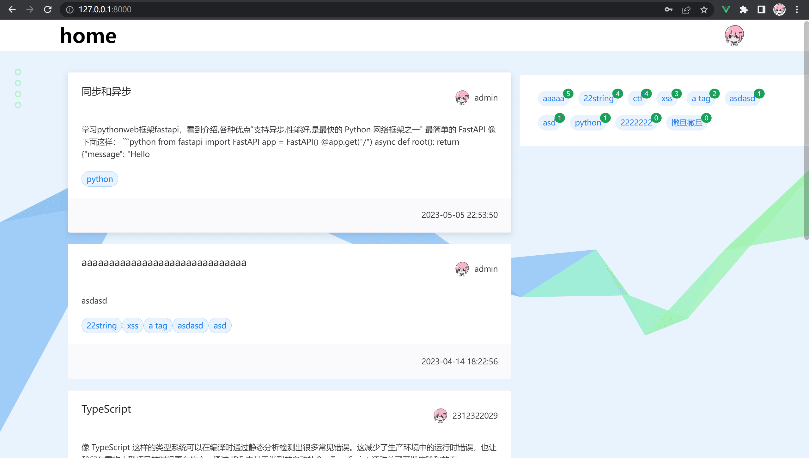
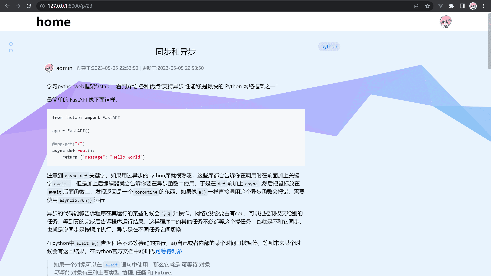
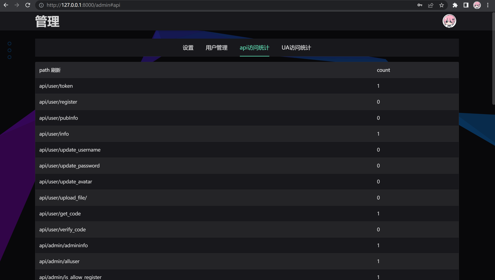
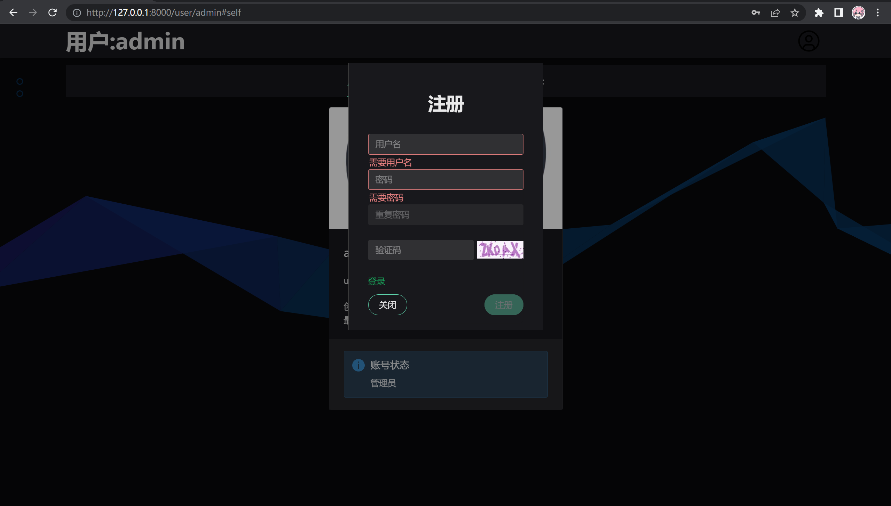
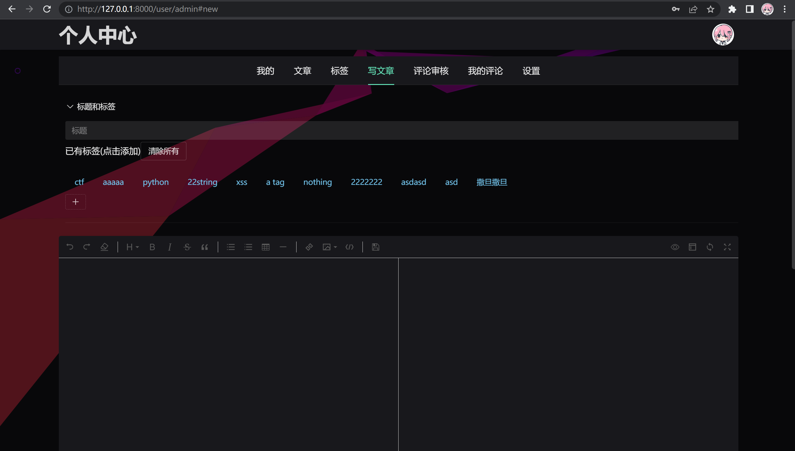
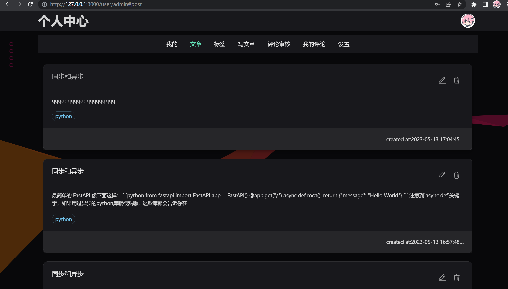

 + server

   + fastapi sqlalchemy aiomysql实现 RESTful API与api文档自动生成，pydantic数据校验
   + 前后端鉴权使用[OAuth2 实现 Bearer JWT 令牌](https://fastapi.tiangolo.com/zh/tutorial/security/oauth2-jwt/)
   + slowapi限制api速率
   + Pillow库生成简单验证码,文本文件缓存验证码
+ client

  + vite + ts
  
  + vue3 + vue-router + navie-ui
  
  + openapi-generate-typescript自动生成axios请求代码

  + markdown解析和高亮使用highlight.js,编辑器[v-md-editor](https://code-farmer-i.github.io/vue-markdown-editor/zh/)
  
+ feature
  
  + 访问统计
  + 导出excel
  + 图片压缩上传
  + 暗色模式
  + 有用的命令行参数`python app.py -h`查看
  + optional(main.ts文件中可选开启)
    + 基于websocket 显示在线用户及其所在路径
    + ~~服务器监控(psutil库)~~
    + ~~websocket聊天室~~
  

docker部署nginx,mysql,python3.10,nginx反向代理/api路径(api都以/api开头)单独代理/docs,/openapi.json路径的api文档，/uploads路径挂载文件上传的目录其他路径匹配[回退路由](https://router.vuejs.org/zh/guide/essentials/history-mode.html#nginx)

## 目录结构

```
├─static // vite构建目录
|   ├─dist //nginx静态文件挂载
├─data/mysql //mysql数据，docker挂载目录
├─uploads //文件上传目录
├─utill //验证码生成/校验,cpu监控
├─api //fastapi子路由，数据校验模型
├─sql //数据库连接，crud代码，orm模型
├─config //读取配置文件，环境变量
├─app.py //fastapi主文件
├─config.yaml //主要是mysql信息，fasapi配置
├─...如其名

```


## 后端

1. python>3.10 pip安装依赖 

2. 最好使用虚拟环境
```bash
pip install -r requirements.txt
```

导出

```bash
pip download -d packages/ -r requirements.txt
```

 离线安装导入

```bash
pip install --no-index --find-links=./packages -r requirements.txt
```


2. 配置

修改`config.yaml`
> 修改数据库用户名密码，创建数据库,数据库名填入dbname
> 
> 修改默认用户名密码

3. 启动

```bash
python app.py
```

---
## 前端
在 static 目录

1. 安装依赖
```bash
npm install
```

2. openapi生成代码
```bash
npm run generate-client
```

3. api url 和 img baseurl

## docker部署

git clone https://github.com/2412322029/fastapi_test

编译前端代码，git clone 后上传覆盖dist目录

```bash
docker-compose up -d
```

## 前后端分离部署

后端填写mysql数据库信息到配置文件，或通过环境变量(覆盖前者),配置跨域，pip安装依赖，启动app.py

在main.ts中，修改后端api的url, 图片baseurl

前端代码静态部署（处理回退路由）

## 其他

修改config.yaml中的密钥，compose.yaml的mysql密码，保持mysql容器和python容器密码一致

nginx反向代理ws：

```
location /{
            proxy_pass   http://0.0.0.0:8000;
        }
        location /api/websocket/ {
            proxy_hide_header X-Frame-Options;
            proxy_pass  http://0.0.0.0:8000;

            ＃代理ws
            proxy_http_version 1.1;
            proxy_set_header Upgrade $http_upgrade;
            proxy_set_header Connection "upgrade";
            proxy_set_header Origin ""; 
        }
```


最大文件上传限制：config.yaml中的是python代码中写的限制，还取决于nginx配置文件中client_max_body_size（10m）


## TODO

- tag  -添加-删除 -（修改）
- 用户管理
